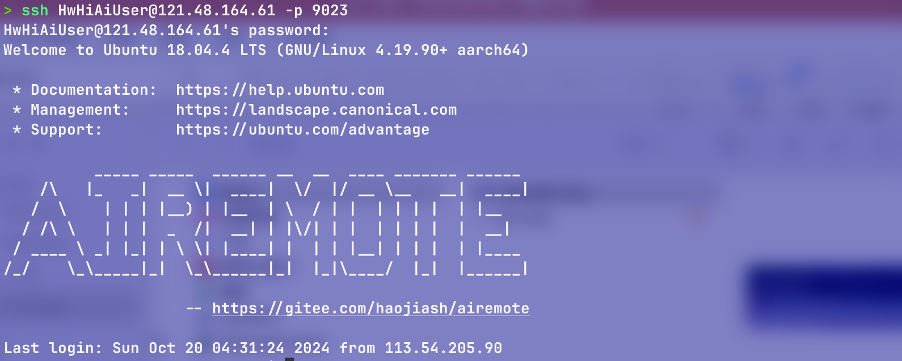
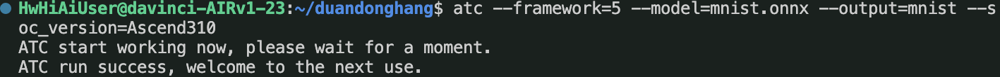
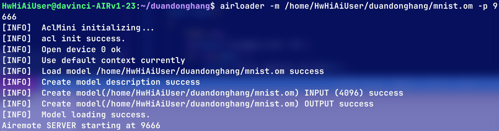
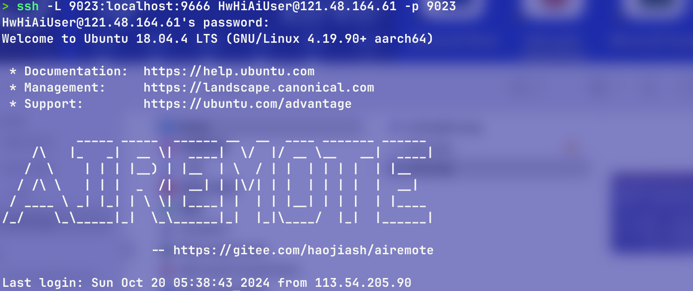
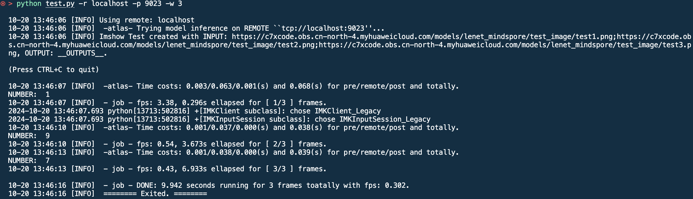

# 基于 Atlas200 的手写数字识别报告

## 一、实验项目名称：基于 Atlas200 的手写数字识别

## 二、任务完成摘要

### 1.目标
在这次的工程创新实践项目中，我们的目标是掌握基于**昇腾Atlas200DK**开发者套件的**LeNet手写数字识别**全流程应用开发方法。

### 2.内容
- 将**MindSpore**深度学习框架训练的**LeNet5**模型导出为**ONNX**模型文件
- 使用**SSH**工具登录开发者套件
- 采用**atc**工具完成昇腾离线模型**OM**转换
- 使用**airloader**工具加载**OM**模型为网络服务
- 结合**AiRemote**远程推理框架进行验证
- 尝试开发创新应用。

### 3.完成情况
- 成功修改`lenet.py`文件中的`pad_mode`属性并运行`convert.py`文件将`lenet5`模型训练好的相关参数导出为`MNIST.onnx`文件
- 成功使用`OpenSSH`工具创建`SSH`密钥，并通过`9023`端口连接到处于同一局域网内的开发者套件集群
- 成功在开发者套件系统中创建单独的文件夹`duandonghang`并将本地训练好的模型文件`MNIST.onnx`上传到文件夹中
- 成功在开发者套件上运行`atc --framework=5 --model=mnist.onnx --output=mnist --soc_version=Ascend310`命令，使用`atc`工具将`onnx`文件转化为可在开发者套件上运行的`om`模型
- 成功在开发者套件上运行`airloader -m /home/HwHiAiUser/duandonghang/mnist.om -p 9666`命令，加载生成的`om`模型为网络服务并挂载到`9666`端口上
- 成功在本地运行`ssh -L 9023:localhost:9666 HwHiAiUser@121.48.164.61 -p 9023`的命令行，在不借助额外工具的条件下，利用`OpenSSH`自带的命令行功能实现本地`9023`端口到开发者套件`9666`端口的转发
- 成功在本地使用`python test.py -r localhost -p 9023 -w 1`命令行，通过本地`9023`端口运行`test.py`文件，并在开发者套件上实现实时推理与结果返回（将时间间隔设置为1s）
  
## 三、实验原理
- 卷积神经网络：**LeNet5**是经典的卷积神经网络，网络简单，具有较好的视觉特征提取能力
- 开发者套件登录：**SSH**是安全的远程登录工具，可实现对AI设备的访问、系统管理和文件传输
- 模型转换与部署：采用**atc**工具转换在CPU上训练的模型，并在开发者套件部署为推理服务
- 图像输入与处理：在桌面计算上进行图像采集和处理，并通过**AiRemote**框架经网络传输到昇腾AI设备上完成推理并取回结果

## 四、实验目标
掌握基于昇腾**Atlas200DK**开发者套件的**LeNet**手写数字识别全流程应用开发方法。

## 五、实验内容

### 1. 将MindSpore深度学习框架训练的LeNet5模型导出为ONNX模型文件
首先，使用MindSpore深度学习框架训练LeNet5模型。在训练完成后，使用MindSpore提供的API将训练好的模型导出为ONNX格式的模型文件。ONNX是一种开放的神经网络交换格式，可以方便地在不同平台之间移植和部署深度学习模型。

### 2. 使用SSH工具登录开发者套件
使用SSH工具与Atlas200DK开发者套件建立安全连接。首先在本地通过OpenSSH工具创建SSH密钥，然后通过SSH命令行工具连接到开发者套件所在的局域网中，进行远程的文件管理与操作。确保开发者套件已正确连接网络，并能够通过指定端口进行通信。



### 3. 采用atc工具完成昇腾离线模型（OM）转换
在开发者套件中，使用ATC（Ascend Tensor Compiler）工具将ONNX格式的模型转换为昇腾平台支持的OM（昇腾模型）格式。ATC工具能够针对Ascend芯片架构进行优化，从而提高模型的推理性能。具体命令为：
```bash
atc --framework=5 --model=mnist.onnx --output=mnist --soc_version=Ascend310
```
此命令会将MNIST手写数字识别的ONNX模型转换为可以在Atlas200DK上运行的OM格式模型。



### 4.使用airloader工具加载OM模型为网络服务
转换后的OM模型需要加载到开发者套件中作为推理服务。使用airloader工具加载OM模型，并将其挂载到指定的网络端口上，供远程设备访问和调用推理服务。执行以下命令：
```bash
airloader -m /home/HwHiAiUser/duandonghang/mnist.om -p 9666
```
该命令会在开发者套件上启动一个推理服务，运行转换后的mnist.om模型，并将推理服务挂载在9666端口上。



### 5. 结合AiRemote远程推理框架进行验证
通过SSH端口转发技术，将开发者套件上的推理服务端口转发到本地计算机。使用命令：
```bash
ssh -L 9023:localhost:9666 HwHiAiUser@121.48.164.61 -p 9023
```



该命令将本地9023端口转发到开发者套件的9666端口，实现远程推理服务的本地访问。随后，在本地运行验证脚本：
```bash
python test.py -r localhost -p 9023 -w 1
```



## 六、实验器材
- **设备**：
  *型号名称*：	MacBook Air
  *型号*：	Z1600095HCH/A
  *芯片*：	Apple M2
  *核总数*：	8
  *内存*：	16 GB
  *系统版本*：	macOS 15.0.1 (24A348)
  *内核版本*：	Darwin arm64 24.0.0

- **软件环境与工具**：
  1) **vscode 1.94.2**
  2) **conda 24.5.0**
  3) **python 3.9.16**
  4) **OpenSSH_9.8p1**
  5) **LibreSSL 3.3.6**

### 七、实验步骤与非平凡内容
1. **模型训练与导出**：
    - 在本地通过MindSpore框架训练LeNet5模型，并导出为ONNX模型。导出过程中，确保模型结构和参数与昇腾硬件兼容，特别是`pad_mode`的正确设置。
    - 容易出错的点：确保使用`convert.py`生成的`onnx`文件，否则可能导致模型加载失败——由于在上次在本地运行时我用其他方法导出了`onnx`文件，但是最后发现上次导出的文件无法挂载到模型上。

2. **SSH登录与文件传输**：
    - 使用OpenSSH工具登录Atlas200DK开发者套件，通过`9023`端口进行远程操作和文件传输。确保局域网连接稳定。
    - 推荐内容：为了提高文件传输效率，可以使用`vscode`中的`remoteSSH`插件进行操作。

3. **模型转换与推理部署**：
    - 使用atc工具将ONNX模型转换为OM模型。确保`Ascend310`版本正确，特别是在多个设备使用时，设备版本的一致性非常重要。
    - 容易出错的点：atc转换命令的参数配置，如`--framework=5`表示ONNX模型，必须正确设置。

4. **推理服务启动与验证**：
    - 通过airloader工具将OM模型加载为网络服务，并通过SSH端口转发实现本地与远程设备的推理交互。
    - 容易出错的点：本地和远程端口映射不正确时，会导致无法连接推理服务。推荐使用`netstat`工具查看端口是否成功监听。

### 八、实验数据及结果分析
1. **推理准确率**：使用标准MNIST数据集对LeNet5模型进行推理测试，输出结果基本正确。
  
2. **推理时间**：在开发者套件上的推理时间平均为**0.04s**，符合期望的高效推理要求。

### 九、实验结论
1. 本次实验成功实现了基于Atlas200DK开发者套件的LeNet手写数字识别应用，整个流程从模型训练、转换、部署到推理验证都顺利完成。
2. 系统在推理速度和准确率上表现良好，适用于手写数字识别的实际应用场景。通过进一步优化模型和硬件资源配置，可提升模型推理的性能。

### 十、总结及心得体会
1. **对任务的理解**：通过这次实验，深入了解了深度学习模型的全流程部署，尤其是在边缘设备上的推理实现。通过Atlas200DK平台，可以更好地学习并掌握如何将训练模型迁移到实际硬件中进行高效推理。
  
2. **收获**：不仅加强了对深度学习模型转换和部署工具的认识，还提高了在嵌入式设备上处理AI任务的能力。尤其是掌握了如何使用SSH进行远程操作、模型转换等关键技术。
  
3. **展望**：未来希望能将手写数字识别扩展到更多复杂场景中，如手写文字识别和多字符联合识别，同时探索更多实际应用场景如边缘计算、实时监控等。

### 十一、对本实验过程及方法、手段的改进建议
1. **优化模型转换流程**：atc工具在模型转换过程中存在较长的执行时间，建议未来优化工具的性能，提升转换速度。
2. **改进推理验证方法**：目前推理验证是基于本地端口转发进行的，可以考虑引入更高效的网络框架，减少传输延迟，提高推理响应速度。
3. **增加可视化工具支持**：目前推理结果只能通过命令行展示，建议集成实时可视化工具，便于用户更直观地观察推理结果与性能指标。
4. **自动化部署工具**：为了简化流程，可以开发自动化脚本，一键完成模型转换、推理服务部署和验证工作，从而减少人工操作。
---